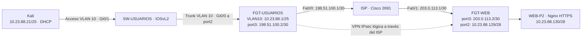

# Infraestructura 1 — VPN site-to-site FortiGate

## Video de demostración

**[Ver demostración en YouTube](https://youtu.be/bFbWRIkF2yI)**

**Autor:** Axel Enrique Vasquez Peña · **Matrícula:** 2024-2388  
**Asignatura:** Seguridad de Redes · Semana 3, Práctica 2

## Objetivo

Comunicar un usuario con un servidor HTTPS a través de una VPN IPsec entre dos FortiGate y comprobar que el acceso se pierde cuando el túnel se desactiva y se recupera al restaurarlo.

La configuración y las acciones de demostración de los FortiGate se realizaron por GUI. Los comandos incluidos corresponden al ISP, switch y equipos Linux.

## Topología

Administración auxiliar: Windows 192.168.6.1 → VMnet1 → GNS3 VM eth0 / ADMIN-VM → SW-ADMIN → port1 de ambos FortiGate. Esta red permite administración y no forma parte del trayecto de usuarios por la VPN.

## Direccionamiento

| Equipo / interfaz | Dirección | Función |
|---|---|---|
| FGT-USUARIOS port1 | 192.168.6.135/24, DHCP | Administración |
| FGT-WEB port1 | 192.168.6.136/24, DHCP | Administración |
| FGT-USUARIOS VLAN10-USUARIOS sobre port2 | 10.23.88.1/25 | Gateway y DHCP de usuarios |
| Kali eth0 | 10.23.88.21/25 observada | Cliente DHCP; puede cambiar |
| FGT-USUARIOS port3 | 198.51.100.2/30 | WAN sede usuarios |
| ISP Fa0/0 | 198.51.100.1/30 | Gateway WAN usuarios |
| ISP Fa0/1 | 203.0.113.1/30 | Gateway WAN WEB |
| FGT-WEB port3 | 203.0.113.2/30 | WAN sede WEB |
| FGT-WEB port2 | 10.23.88.129/28 | Gateway servidor |
| WEB-P2 ens33 | 10.23.88.130/28 | Servidor HTTPS |

Las WAN utilizan bloques reservados para documentación que simulan IP públicas en el laboratorio; no son direcciones públicas asignadas para Internet. DHCP de usuarios: 10.23.88.2–10.23.88.126, máscara 255.255.255.128, gateway 10.23.88.1.

## Resultados comprobados

| Prueba | Resultado observado | Evidencia |
|---|---|---|
| VLAN 10 y trunk | Gi0/0 trunk 802.1Q, VLAN 10 en forwarding; Gi0/1 acceso VLAN 10 | [Trunk](01-switch-trunk.png), [VLAN](02-switch-vlan.png) |
| Cliente DHCP | Kali 10.23.88.21/25; ruta por DHCP a 10.23.88.1 | [DHCP](03-kali-dhcp.png) |
| VPN establecida | VPN-SEDE-B y VPN-SEDE-A en Up | [Usuarios](04-vpn-usuarios-up.png), [WEB](05-vpn-web-up.png) |
| Página HTTPS | Página vpn.html visible desde Kali | [Navegador](06-https-kali.png) |
| Traceroute | 10.23.88.1 → 192.168.6.136 → 10.23.88.130 | [Traceroute](07-traceroute.png) |
| VPN desactivada | Ping: 100 % pérdida; HTTPS: timeout | [Sin VPN](08-vpn-desactivada.png) |
| VPN restaurada | HTTPS vuelve a HTTP/1.1 200 OK | [Restauración](09-vpn-restaurada.png) |
| NAT hacia ISP | Ping 4/4; captura WAN con dirección traducida 198.51.100.2 | [NAT](10-nat-isp.png) |

El segundo salto del traceroute usa una dirección de respuesta de FGT-WEB; no demuestra tránsito por la red de administración. La prueba controlada activa/desactivada/restaurada demuestra la dependencia del acceso respecto al túnel en la configuración probada.

## Contenido

- [Configuración documentada por GUI](CONFIGURACION-GUI.md): interfaces, VPN, rutas y políticas.
- [Pruebas y comandos](PRUEBAS.md): secuencia reproducible y resultados esperados.
- [ISP](ISP.cfg) y [switch](SW-USUARIOS.cfg): fragmentos de configuración reconstruidos de los comandos aplicados; no son respaldos completos exportados.
- [Página HTTPS](vpn.html): contenido estático independiente de la aplicación anterior.
- [Guion de demostración](GUION.txt).

## Alcance y limitaciones

FortiOS 7.0.9 build 0444, licencia de evaluación. Se utilizó DES-SHA256 por las opciones de cifrado disponibles en el laboratorio. DES es débil y esta configuración no se propone para producción. Las pruebas curl usan `-k` para el certificado de laboratorio; no verifican la confianza del certificado.

NAT se demuestra separadamente con PING al ISP, no dentro de la VPN. No se afirma conectividad real a Internet. Las políticas VPN permiten HTTPS y PING iniciados desde usuarios hacia WEB y sus respuestas, no cualquier servicio ni conexiones nuevas iniciadas desde WEB.

Se incluye documentación y capturas, no imágenes IOS/FortiOS, licencias, certificados privados, claves compartidas ni respaldos completos de los FortiGate. Los respaldos originales deben conservarse de forma privada. Este repositorio corresponde solo a la infraestructura 1.
